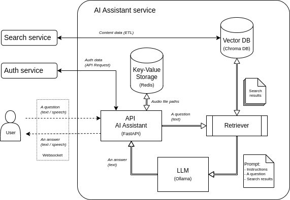

# Сервис ИИ Ассистент

## Описание.
В сервисе реализован чат с ИИ Ассистентом, который отвечает на вопросы и имеет возможность подкреплять ответы данными о фильмах на основе RAG (Retrieval Augmented Generation).

### Схема сервиса:

Более подробно сервис описан по [ссылке](fastapi_ai_assistant/README.md).

### Основные команды для запуска сервисов:

- **запуск сервисов в docker compose**: 
`make up`;
- **остановка сервисов**: 
`make destroy`;
- **тесты ai_assistant_api**:
`make tests-ai`.

Более подробно все основные команды представлены в [Makefile](Makefile).

### ВАЖНО:
- Для запуска и функционирования сервисов в Docker необходимо не менее 32Gb RAM.
- После первого запуска всех сервисов запускается ETL-процесс переноса данных в Elasticsearch и Chroma. Данные для RAG доступны после завершения ETL-процесса. 

По умолчанию при разворачивании ollama загружаются модели: "gemma2:9b", "llama3.2:3b", "evilfreelancer/enbeddrus". 
Для использования в чате других моделей их необходимо установить дополнительно. 
